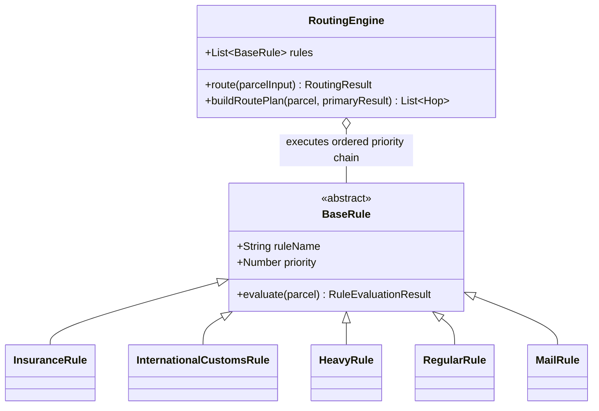
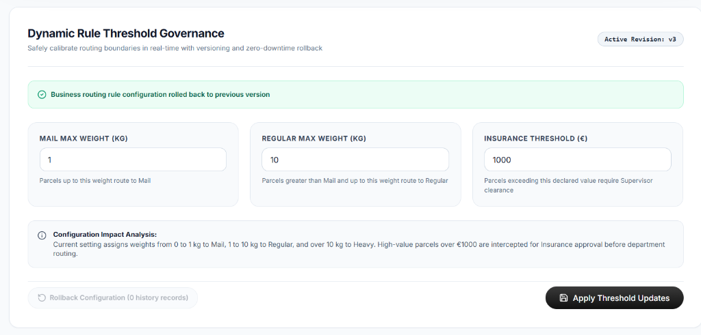
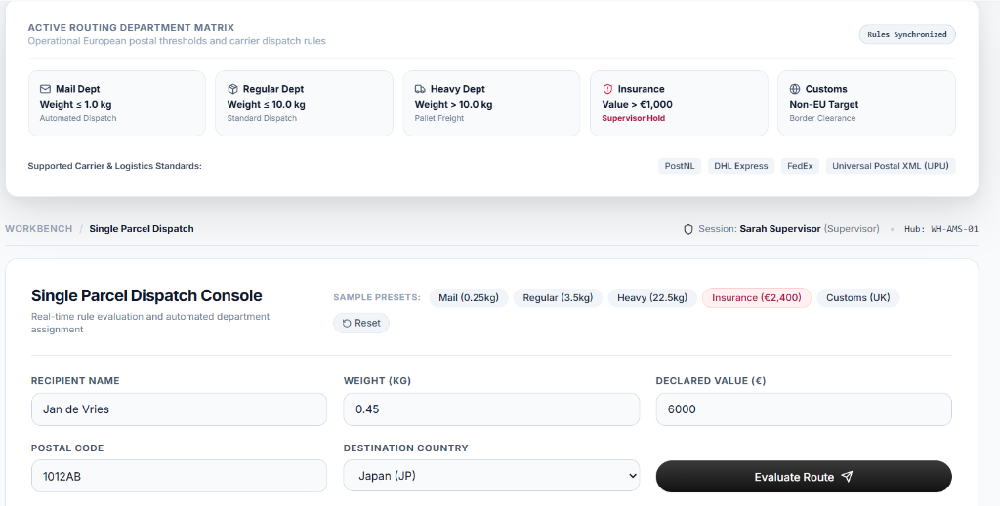
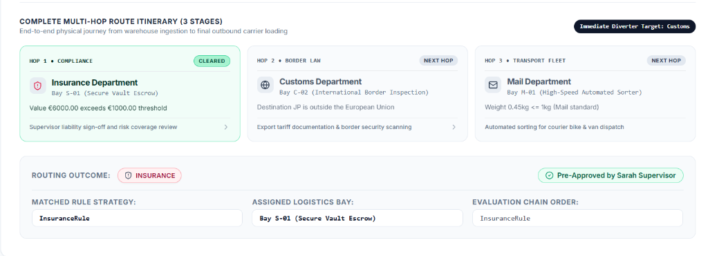
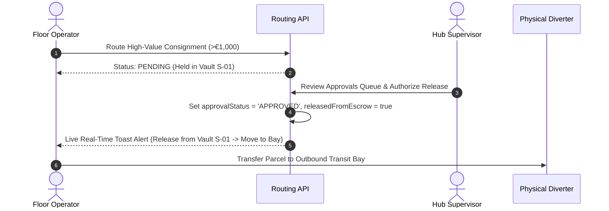

# Modernized Automated Parcel Routing System

An enterprise-grade, rule-based sortation engine designed for high-throughput logistics hubs. Bridges legacy carrier manifests with real-time conveyor automation through sub-millisecond diverter assignment, multi-hop regulatory compliance, and zero-downtime threshold governance.

| Deliverable | Description | Access Link |
| :--- | :--- | :--- |
| **System Video Demonstration** | End-to-End Architecture & Workflow Demo | [Google Drive Video](https://drive.google.com/file/d/1ErSf3UhWx0u6lcyYPvycDW2CcLUNs_L-/view?usp=sharing) |
| **Technical Presentation Deck** | 10-15 Minute Systems Presentation | [Google Drive Presentation](https://drive.google.com/file/d/1DcF2cWgb5WgUjQOpBOmTWDz1yOYelUjO/view) |
| **AI Usage Document** | Full Specification & Prompt Analysis | [Google Drive Document](https://drive.google.com/file/d/1OurkPNOZWobM419QmdwmH4TCfgiEiRWL/view?usp=drive_link) |


---

## 1. Core Architectural Capabilities

- **Sub-Millisecond Routing Latency:** Sub-0.2ms execution enables line-speed sortation for physical conveyor belts.
- **Regulatory vs. Transport Disambiguation:** Isolates compliance checkpoints (Insurance, Customs) from physical fleet logistics (Mail, Regular, Heavy).
- **Multi-Hop Sequential Transit Planning:** Generates complete end-to-end itineraries (e.g. Ingestion -> Vault Escrow -> Border Customs -> Courier Fleet).
- **Dual-Role Intake Authority:** Hub Supervisors evaluate consignments with instant clearance; Floor Operators automatically trigger vault escrow holds.
- **Closed-Loop Floor Notifications:** Real-time toast alerts notify floor operators immediately when a held parcel is cleared by a supervisor.
- **Universal Manifest Ingestion:** Native streaming support for legacy UPU XML manifests (`Container_68465468.xml`) and modern JSON payloads.
- **Dynamic Runtime Governance:** Zero-downtime threshold calibrations with instant configuration impact previews and version rollback.

---

## 2. Routing Strategy & Department Matrix



### Department Classification Matrix

| Priority | Department | Rule Category | Operational Trigger | Assigned Logistics Bay |
| :---: | :--- | :--- | :--- | :--- |
| **1 (Highest)** | **Insurance** | Regulatory Gate | Declared Value > €1,000 | `Bay S-01 (Secure Vault Escrow)` |
| **2** | **Customs** | Regulatory Gate | Destination Country outside EU | `Bay C-02 (Border Inspection Gate)` |
| **3** | **Heavy** | Physical Fleet | Weight > 10.0 kg | `Bay H-04 (Pallet Freight & Forklift)` |
| **4** | **Regular** | Physical Fleet | Weight > 1.0 kg and <= 10.0 kg | `Bay R-02 (Standard Delivery Van)` |
| **5 (Default)** | **Mail** | Physical Fleet | Weight <= 1.0 kg | `Bay M-01 (Automated Sorter & Bicycles)` |

### Runtime Threshold Governance

- **Live Calibration:** Supervisors adjust operating thresholds (e.g. Mail ceiling, Insurance floor) dynamically without restarting services.
- **Audit & Safety Controls:** In-memory versioning preserves full audit trails and allows one-click rollbacks to previous states.
- **Impact Preview:** Previews how pending threshold modifications affect currently queued parcels before activation.



---

## 3. Multi-Hop Itineraries & Floor Operations



### Sequential Itinerary Resolution
When a consignment matches multiple operational conditions (e.g. a €6,000 parcel weighing 0.45 kg destined for Tokyo, Japan):
- **Hop 1 (Immediate Diverter Action):** `Insurance` -> Vault Escrow `Bay S-01` (requires supervisor clearance).
- **Hop 2 (Regulatory Intermediate):** `Customs` -> International Border Inspection `Bay C-02`.
- **Hop 3 (Final Transport Fleet):** `Mail` -> Automated Sorter & Bicycle Delivery `Bay M-01`.



### Closed-Loop Operator & Supervisor Workflow



---

## 4. Key Architectural Decisions

| Decision Area | Technical Implementation | Rationale & Trade-offs |
| :--- | :--- | :--- |
| **Ingestion Engine** | `fast-xml-parser` with unified JSON normalizer | High-speed parsing handles legacy UPU XML manifests and web JSON without heavy external schema runtimes. |
| **Rule Execution** | In-Memory Strategy Pattern | Sub-0.2ms latency meets conveyor sortation deadlines; avoids external BPMN engine network overhead. |
| **State Synchronization** | 3-Second Reactive Polling | Keeps floor operators informed of supervisor approvals without websocket connection maintenance overhead. |
| **Dual Intake Authority** | Contextual Role-Based Routing | Eliminates redundant approval cycles for supervisors while enforcing strict custody holds for operators. |

---

## 5. Defensive Security Hardening

- **XXE Injection Defense:** Parser configured with `processEntities: false` to structurally block external entity loading and file disclosure.
- **Billion Laughs Mitigation:** Disallows DTD parameter parsing to eliminate exponential entity expansion denial-of-service risks.
- **API Rate Limiting:** Token-bucket rate limiters prevent API flood attacks and conveyor sortation backlog saturation.
- **Cryptographic RBAC:** Signed JSON Web Tokens (JWT) enforce separation of duties between Operator and Supervisor actions.

---

## 6. Real-Time Telemetry & Anomaly Detection

- **Macro Facility Anomalies:** Detects statistical surges across the facility floor:
  - *Insurance Surge:* Triggers when vault diversions exceed 15% of nominal volume.
  - *Heavy Load Spike:* Flags when freight exceeding 10kg surpasses 12% of conveyor capacity.
  - *Customs Surge:* Alerts when non-EU international parcels exceed 20% of batch intake.
- **Micro Consignment Outliers:** Identifies individual high-risk items:
  - Extreme valuations (€2,500+) queued for specialized escrow handling.
  - Heavy freight (20kg+) requiring specialized forklift and pallet logistics.
- **Telemetry Reset Utility:** Allows operators and supervisors to reset telemetry counters to zero to evaluate fresh batches from a clean slate.

---

## 7. Extensibility: Adding a New Rule

Adding a new routing rule (e.g. `PerishableGoodsRule`) requires three simple steps:

1. **Implement Rule Class:** Extend base rule interface with `isMatch(parcel)` and `evaluate(parcel)`.
2. **Assign Priority Number:** Position within the priority hierarchy (e.g. Priority 45 between Customs and Heavy).
3. **Register with Engine:** Register rule with `RoutingEngine.registerRule(new PerishableGoodsRule())`.

```javascript
export class PerishableGoodsRule {
  name = 'PerishableGoodsRule';
  priority = 45;

  isMatch(parcel) {
    return Boolean(parcel.isPerishable);
  }

  evaluate(parcel, history = []) {
    return {
      parcelId: parcel.id,
      department: 'ColdStorage',
      bay: 'Bay K-01 (Refrigerated Hub)',
      requiresApproval: false,
      matchedRule: this.name,
      evaluatedRules: [...history, this.name],
    };
  }
}
```

---

## 8. Section 7: AI Usage & Engineering Governance

| Deliverable | Description | Link |
| :--- | :--- | :--- |
| **Comprehensive AI Usage Document** | Full prompt transcripts, engineering modifications, and limitations | [Google Drive Document](https://drive.google.com/file/d/1OurkPNOZWobM419QmdwmH4TCfgiEiRWL/view?usp=drive_link) |


- **Part 1 (Routing Engine Scaffolding):** AI drafted initial Strategy classes. Human engineering corrected inclusive boundary conditions (`<= 1.0 kg`), encapsulated private fields (`#rules`), and implemented multi-hop sequential continuity.
- **Part 2 (Defensive Security & Testing):** AI suggested naive regex tag stripping. Human engineering rejected regex in favor of parser-level hardening (`processEntities: false`) and engineered dual-role intake governance.
- **Human Governance:** 100% of final production logic, security configurations, and 38 passing Vitest tests were verified and governed under direct human engineering oversight.

---

